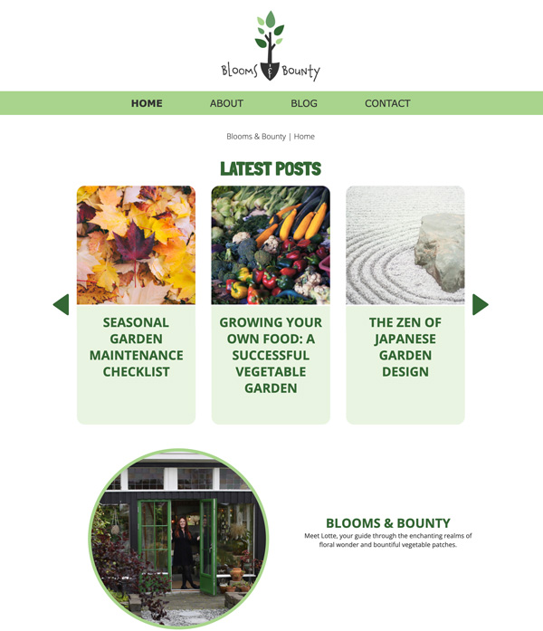

# Project Exam - Blooms & Bounty Blog



## Description

Blooms & Bounty is a gardening blog serving the readers diy tips about gardening

Featuers:

- Read blogpost
- Comment
- Ask questions

## Built With

- JavaScript
- HTML
- CSS

### Installing

1. Clone the repo:

```bash
git clone git@github.com:NoroffFEU/portfolio-1-example.git
```

### Running

Open the file in Live server

## Contact

lotteaasha@hotmail.com

## License

[License](LICENSE)
